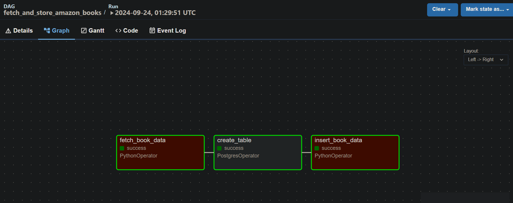
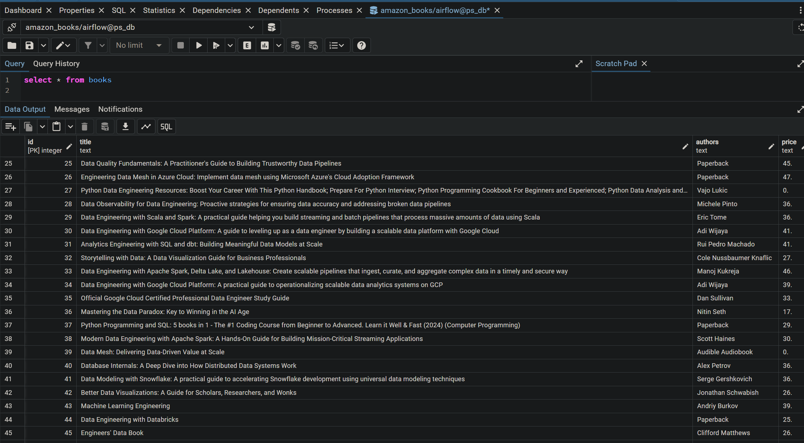
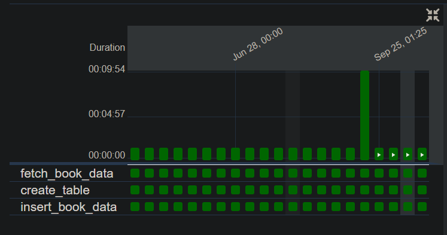

Purpose
=======
To orchestrate a DAG on Airflow as well as dockerizing airflow, postgres, and pgadmin. The data is scraped from AWS and is simply a table of current Data Engineering books. The DAG is scheduled to run once a day. This project will be expanded upon with more complexity in DAG tasks, including modeling with dbt, creation of aggregated tables and marts, and SCD 2 type upserting. 

Run
===
Install [Docker](https://docs.docker.com/engine/install/) 

run: 
`docker compose up`   

view airflow: `localhost:8080`  

view pgadmin:`localhost:5050` 

username:`admin`  

password:`admn` 

## Checkout DAG diagram:

## Query table in pgAdmin:

## Watch for run status:

